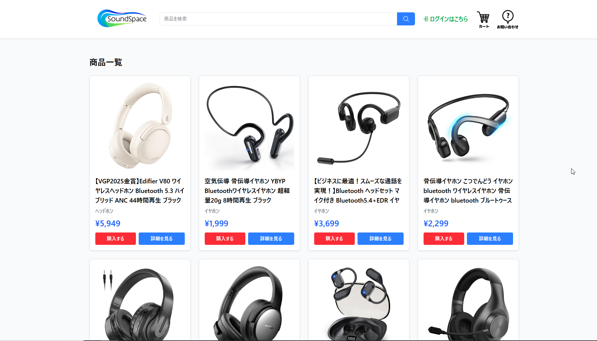
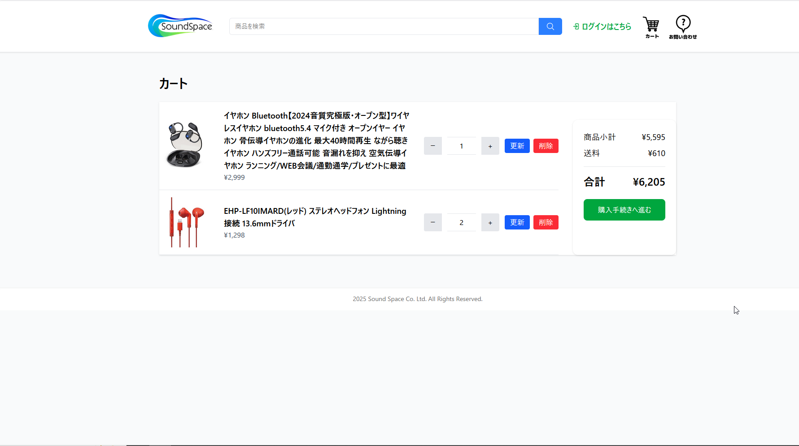
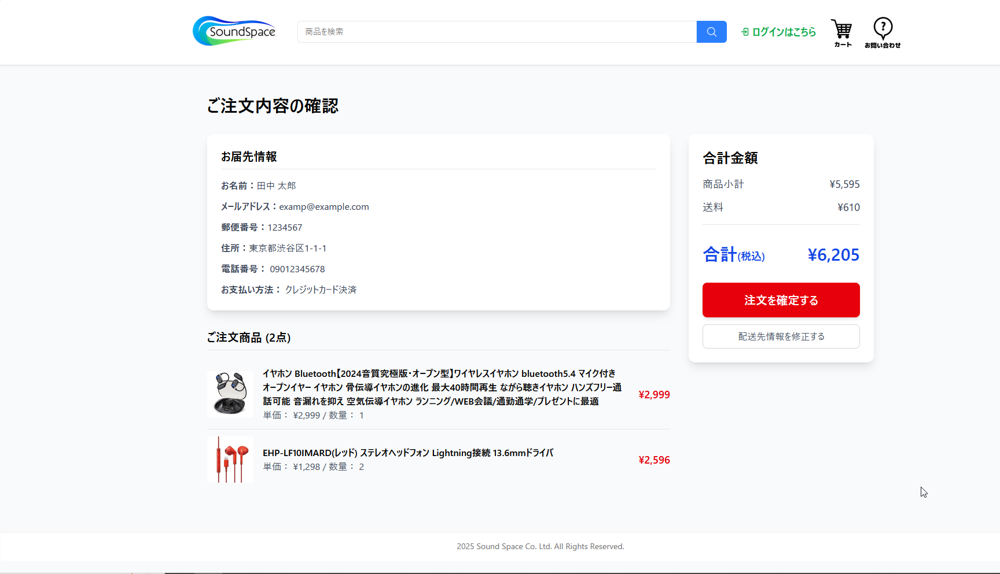
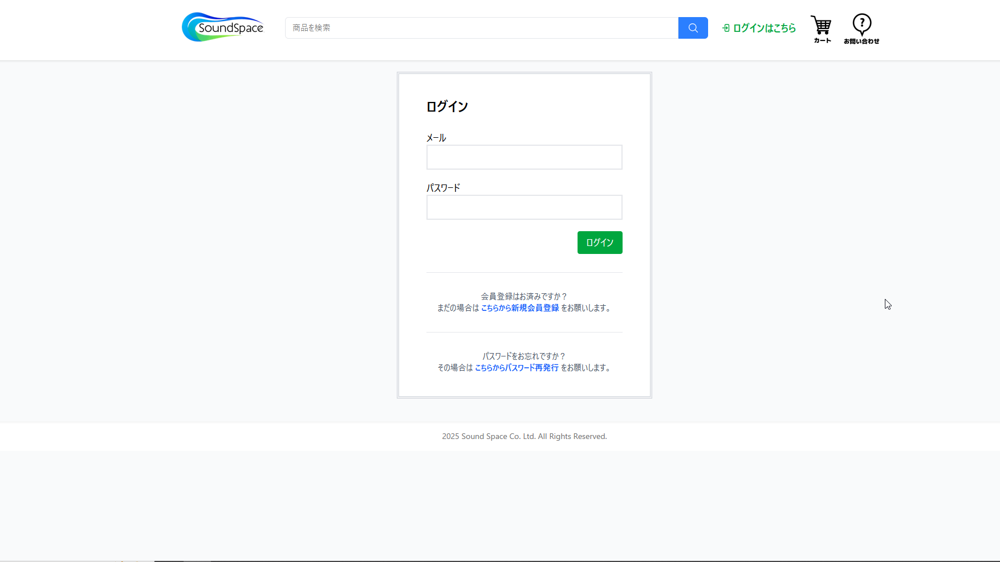
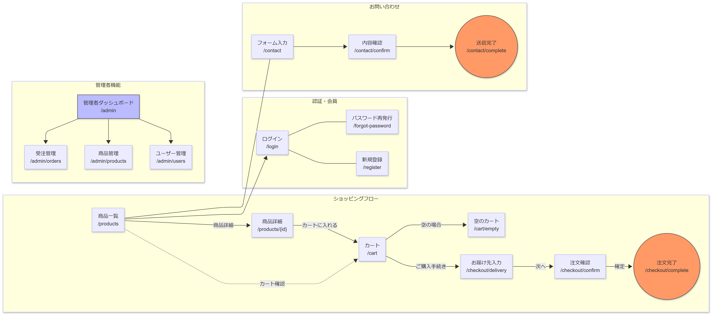

# 🎧 Sound Space — イヤホン・ヘッドホン専門 ECサイト

## 📌 アプリ概要

イヤホン・ヘッドホンの販売を専門とするECサイトです。  
会員登録から商品購入までの一連のフローを実装しています。  
また、DB設計・テスト仕様書の作成やCIの導入など、実務に近い開発フローを意識して制作しました。

> 💡 会員登録なしのゲスト状態でも商品の閲覧・購入が可能です。

🔐 **テストアカウント**:
- メール: `exam@example.com`
- パスワード: `12345678`

---

## 🖼️ 画面スクリーンショット

| 商品一覧 | カート |
|---|---|
|  |  |

| 注文内容確認 | ログイン |
|---|---|
|  |  |

---

## 🎯 作成背景・目的

就労移行支援事業所の支援員の方に勧められたことをきっかけに、ECサイトを題材として選びました。  
普段から身近に使っているサービスであるため実装すべき機能のイメージがしやすく、PHPで学んだことの総復習・アウトプットとして最適だと判断しました。

商品ジャンルをイヤホン・ヘッドホンに絞ったのは、総合ショッピングサイトより開発スコープを明確にするためです。商品の属性の幅を制限することでDB設計の複雑化を避け、その分ロジックの実装に集中することができました。

🔗 **素書き版リポジトリ**: [yuzuniT/shop](https://github.com/yuzuniT/shop)

素のPHPで一度実装したことで、Laravelが内部で行っている処理への理解を深めた状態で開発に臨むことができました。

---

## ⚙️ 使用技術

| カテゴリ | 技術・バージョン |
| --- | --- |
| フロントエンド | Blade, Livewire 3.6.4, Tailwind CSS 4.0.7, Vite 7.0.4 |
| バックエンド | PHP 8.2.12, Laravel 12.39.0, Composer 2.8.10 |
| データベース | SQLite 3.49.2 |
| DB管理ツール | AdminerEvo 4.8.4 |
| 開発環境 | Laravel Herd 1.21.1 (Windows), Node.js 24.5.0, npm 11.5.1 |
| エディタ・ツール | Visual Studio Code, draw.io, Mermaid Live Editor, Google Sheets |
| バージョン管理 | Git 2.37.3 / GitHub / Sourcetree 3.4.23 |
| CI/CD | GitHub Actions（PHPUnit 自動テスト） |
| テスト | PHPUnit 11.5.33 |

---

## 🗂️ 機能一覧

### ① 会員登録・ログイン・パスワード再発行
- メールアドレス・パスワードでの会員登録
- メールアドレス認証による本人確認
- ログイン・ログアウト
- パスワード再発行メール送信

### ② 商品一覧・詳細・カート・注文フロー
- 商品一覧・詳細ページの表示
- カートへの追加・削除
- 配達先入力・注文内容確認・注文確定
- ログイン時は配達先フォームに会員情報を自動入力
- 非ログイン時もゲストとして商品の閲覧・購入が可能
- 注文確定時の二重送信防止

### ③ 管理者機能
- 商品一覧・編集・削除（ページネーション）
- 注文一覧・管理（ページネーション）
- ユーザー一覧・管理（ページネーション）

---

## 📐 設計ドキュメント

### 画面遷移図

### テーブル定義書
📄 [テーブル定義書（Google スプレッドシート）](https://docs.google.com/spreadsheets/d/1-H4M0LD-6WiTapgkK1BNaIZq8mF_2GkkHkKrBK8WQY8/edit?usp=sharing)

### テスト仕様書
📄 [テスト仕様書（Google スプレッドシート）](https://docs.google.com/spreadsheets/d/11X4_Hsr9IE6ipQLv1BW6WoUgGWmN8Gpaqcm-onyXw-o/edit?usp=sharing)

---

## 💡 工夫した点・苦労した点

### 注文フローにおけるデータ整合性の確保
カートへの追加→注文内容確認→注文確定という一連のフローはECサイトの核とも言える部分であるため、細心の注意を払い設計しました。最初はセッションやデータベース間でのデータの受け渡し方法がつかめず、処理の流れを図に書き起こしながら整理することで理解を深めました。

### LivewireによるインタラクティブなUIの実装
書籍でLivewireの挙動に感銘を受けたことがきっかけで採用しました。「JavaScriptを使わなくてもリアクティブなUIが実現できる」と感動し取り入れたものの、最初はイベントフックなど新しい概念に慣れず苦労しました。その都度他の方の実装例を調査しながら乗り越えました。

認証機能（ログイン・会員登録・パスワード再発行）および管理者向けの注文・商品・ユーザー一覧ページにLivewireを採用し、WithPaginationを使用したページネーションを実装しています。

### 商用サービスを想定した網羅的なテスト
単に機能を実装して終わりにするのではなく、5つの主要機能（商品・カート・注文・認証・お問い合わせ）にわたるテスト仕様書を作成し網羅的なテストを実施しました。正常系だけでなく「在庫数を超えるカート投入」「URLへの無効な値の入力」「検索窓へのスクリプト入力」など異常系・セキュリティを意識したテストケースも設計・実行しました。

### Issueベース開発によるタスク管理
実装したい機能や改善点が頭の中で散漫になりがちなため、GitHubのIssue機能をTodoリストとして活用する開発フローを取り入れました。個人開発ではありますが、就職後のチーム開発を見越してIssue・Pull Requestを使った開発を意識的に経験するようにしました。

---

## 📈 今後追加したい機能

- [x] 管理者機能（商品・注文・ユーザーの一覧・編集・削除）
- [ ] マイページ（注文履歴確認）
- [ ] 本番環境へのデプロイ

---

## 📚 参考にした記事・書籍

- [PHP+MySQLで簡易ログインシステムを作る](https://qiita.com/Naughty1029/items/08b0ddeb805442916239)
- [一人開発でもIssueベース開発を行う](https://qiita.com/braveryk7/items/5208263cd06a8878f0c2)
- [DB設計 テーブル定義書 テンプレート](https://qiita.com/maco165/items/83ec720277a52cc61a27)
- [[テンプレート付]テスト設計書の書き方例](https://zenn.dev/ik_takagishi/books/5c6c9fe3a7ad2c/viewer/908fa3)
- PHPフレームワーク Laravel入門 第3版
